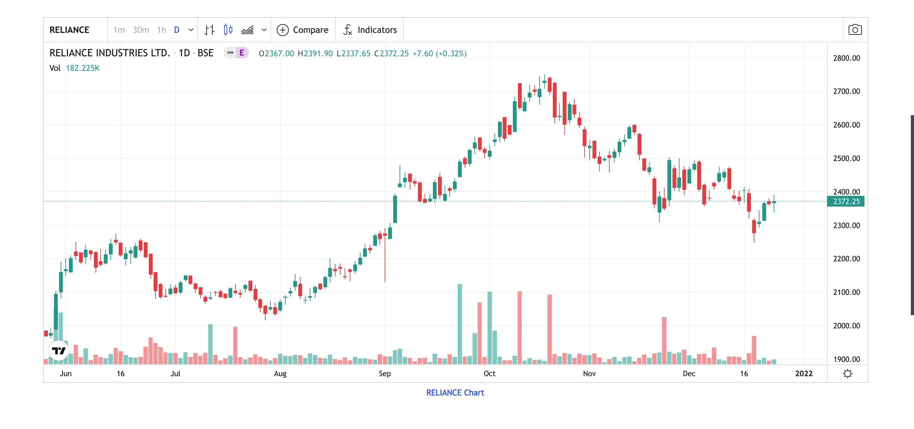
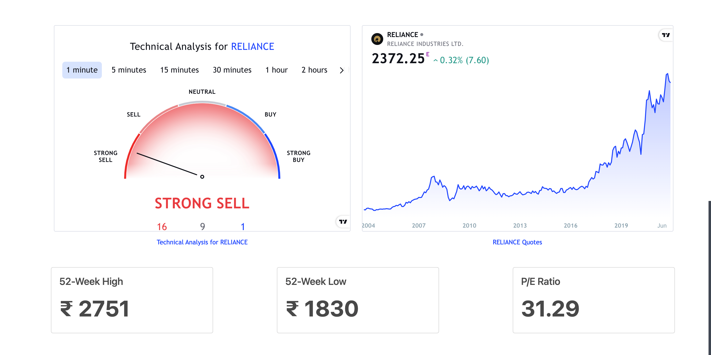

# E-Trader Hub: Empowering Your Stock Market Journey

As the number of new retail investors in the stock market continues to surge, a pressing issue has emerged — a sudden lack of guidance and experience. Many individuals easily fall prey to tips and tricks, making short-term profits. However, with markets currently reaching all-time highs, the question arises: What now? How do we navigate this evolving landscape?

## E-Trader Hub Overview

E-Trader Hub is your comprehensive solution for planning and succeeding in your financial journey. E-Trader Hub stands as a stock market terminal equipped with all the essential features to empower your stock trading endeavors. It encompasses a virtual trading terminal, a visualization dashboard, and historical pattern analysis for a vast array of stocks.

## Key Features

1. **Comprehensive Data Visualization:**
   Users can effortlessly visualize and conduct fundamental analysis for any company. Essential company information, an all-time candlestick intraday chart, technical analysis indicators, 52-Week High/Low Prices, and P/E ratio are readily available for user exploration.

2. **Unique Trading Terminal:**
   Our distinctive Trading Terminal offers users access to historical data within a selected date range. Users can analyze news and technical charts seamlessly on the same dashboard. In simple terms, when a user specifies a date range and selects a preferred stock, the chart updates every 3 seconds (representing 1 day in that time duration). Additionally, sentiment analysis (positive, negative, neutral) accompanies the displayed news, aiding users in understanding how particular news may have impacted stock prices.

3. **Virtual Investment Experience:**
   Users are provided with a virtual amount of INR 1,000 to invest and observe their portfolio based on their specified timeframe. This feature allows users to test their strategies and gain valuable experience without real financial risk.

4. **Timeline of Market Events:**
   E-Trader Hub includes a graph illustrating important stock market events. This feature enables users to analyze past incidents and make informed decisions during their actual stock trading journey, especially when market conditions are less favorable.

E-Trader Hub is more than just a tool; it's a companion in your stock market journey, offering the resources and insights needed to navigate the complexities of the financial landscape.

### Visualisation Dashboard

    
    
     

